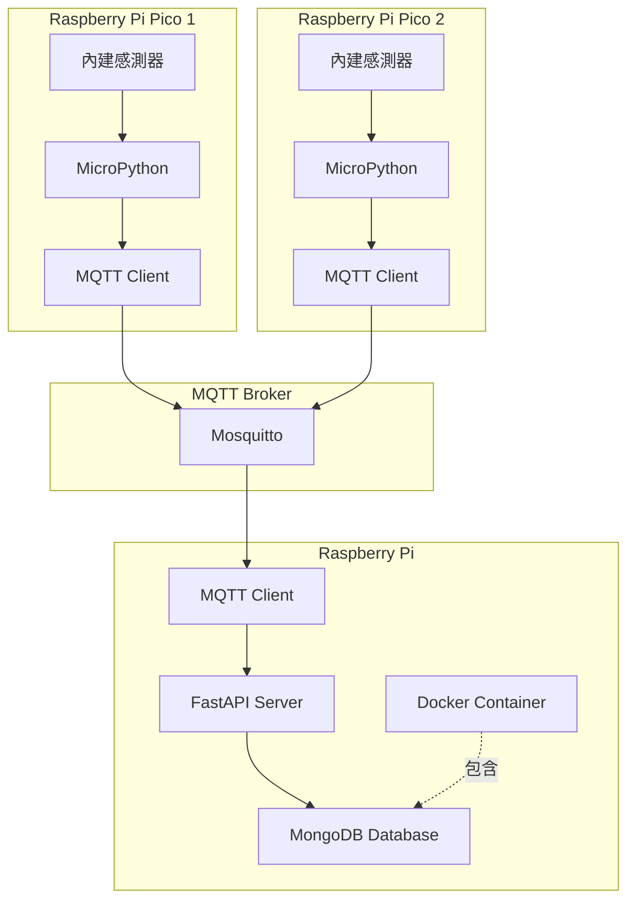

# Design Document

## Overview

本課程講義專案採用模組化設計，將 54 小時的課程內容分為三個主要學習階段：基礎操作、通訊整合、進階應用。每個階段包含完整的範例程式碼、說明文件和練習題。

專案結構設計考慮教學需求，採用循序漸進的方式，讓學生從簡單的單一裝置操作開始，逐步學習到複雜的多裝置整合應用。

## Architecture

### 課程架構

```
第一階段（Day 1-3）：基礎操作
├── Pico 基礎（Day 1-2）
│   ├── 開發環境設定
│   ├── MicroPython 基礎
│   └── 內建感測器操作
└── Pi 基礎（Day 3）
    ├── Docker + MongoDB 設定
    └── FastAPI 基礎

第二階段（Day 4-6）：通訊整合
├── MQTT 通訊（Day 4-5）
│   ├── MQTT 概念與 Broker 設定
│   ├── Pico MQTT 客戶端
│   └── Pi MQTT 客戶端
├── UART/USB 簡介（Day 5 下午）
└── Pi-Pico 整合（Day 6）
    ├── 資料收集流程
    └── 資料儲存與查詢

第三階段（Day 7-9）：進階應用
├── 多裝置管理（Day 7）
├── 整合範例專案（Day 8）
└── 綜合專題與總結（Day 9）
```

### 技術架構



## Components and Interfaces

### 1. Pico 基礎模組

**目的：** 教導學生 Pico 的基本操作和感測器使用

**組件：**
- `01_pico_basics/`
  - `01_led_blink/` - LED 閃爍範例
  - `02_onboard_sensor/` - 內建溫度感測器
  - `03_button_input/` - 按鈕輸入處理
  - `README.md` - 模組說明文件

**介面：**
```python
# 感測器讀取介面
class SensorReader:
    def read_temperature() -> float
    def read_sensor_data() -> dict
```

### 2. Pi 基礎模組

**目的：** 教導學生建立 API 服務和資料庫操作

**組件：**
- `02_pi_basics/`
  - `docker-compose.yml` - MongoDB 容器配置
  - `fastapi_app/` - FastAPI 應用程式
    - `main.py` - API 主程式
    - `models.py` - 資料模型
    - `database.py` - 資料庫連接
  - `README.md` - 模組說明文件

**介面：**
```python
# FastAPI 端點
@app.get("/api/health")
@app.post("/api/data")
@app.get("/api/data")
@app.get("/api/data/{device_id}")

# 資料庫操作
class DatabaseManager:
    def insert_data(data: dict) -> str
    def query_data(filter: dict) -> list
    def get_device_data(device_id: str) -> list
```

### 3. MQTT 通訊模組

**目的：** 教導學生使用 MQTT 進行裝置間通訊

**組件：**
- `03_mqtt_communication/`
  - `mqtt_broker/` - Mosquitto Broker 設定
  - `pico_publisher/` - Pico MQTT 發布者
  - `pi_subscriber/` - Pi MQTT 訂閱者
  - `mqtt_test_tools/` - MQTT 測試工具
  - `README.md` - 模組說明文件

**介面：**
```python
# Pico MQTT 客戶端
class PicoMQTTClient:
    def connect(broker: str, port: int) -> bool
    def publish(topic: str, message: str) -> bool
    def disconnect() -> None

# Pi MQTT 客戶端
class PiMQTTClient:
    def connect(broker: str, port: int) -> bool
    def subscribe(topic: str, callback: function) -> bool
    def on_message(client, userdata, message) -> None
```

### 4. UART/USB 通訊模組

**目的：** 簡介串列通訊方式

**組件：**
- `04_uart_usb/`
  - `pico_uart/` - Pico UART 範例
  - `pi_serial/` - Pi 串列通訊範例
  - `README.md` - 模組說明文件

**介面：**
```python
# 串列通訊介面
class SerialCommunication:
    def open_port(port: str, baudrate: int) -> bool
    def send_data(data: str) -> bool
    def receive_data() -> str
    def close_port() -> None
```

### 5. 整合應用模組

**目的：** 展示完整的 Pi-Pico 整合應用

**組件：**
- `05_integration/`
  - `simple_integration/` - 簡單整合範例
  - `data_collection_system/` - 資料收集系統
  - `README.md` - 模組說明文件

**資料流程：**
```
Pico 感測器 → MQTT 發布 → MQTT Broker → Pi 訂閱 → FastAPI 處理 → MongoDB 儲存
```

### 6. 多裝置整合模組

**目的：** 教導學生管理多個 Pico 裝置

**組件：**
- `06_multi_device/`
  - `device_manager/` - 裝置管理系統
  - `multi_sensor_dashboard/` - 多感測器儀表板
  - `README.md` - 模組說明文件

**介面：**
```python
# 裝置管理
class DeviceManager:
    def register_device(device_id: str, device_info: dict) -> bool
    def get_device_list() -> list
    def get_device_status(device_id: str) -> dict
    def remove_device(device_id: str) -> bool
```

### 7. 範例專案模組

**目的：** 提供完整的實用範例專案

**組件：**
- `07_example_projects/`
  - `environmental_monitor/` - 環境監測系統
  - `smart_home_control/` - 智慧家居控制
  - `data_logger/` - 資料記錄器
  - `alert_system/` - 警報系統
  - `dashboard_visualization/` - 資料視覺化儀表板
  - `README.md` - 專案說明文件

## Data Models

### 感測器資料模型

```python
{
    "device_id": "pico_001",
    "device_type": "pico_w",
    "timestamp": "2025-10-11T10:30:00Z",
    "sensor_type": "temperature",
    "value": 25.5,
    "unit": "celsius",
    "location": "classroom_a"
}
```

### 裝置資訊模型

```python
{
    "device_id": "pico_001",
    "device_name": "Temperature Sensor 1",
    "device_type": "pico_w",
    "status": "online",
    "last_seen": "2025-10-11T10:30:00Z",
    "location": "classroom_a",
    "sensors": ["temperature", "led"],
    "mqtt_topic": "sensors/pico_001"
}
```

### MQTT 訊息格式

```python
# Topic 結構
sensors/{device_id}/{sensor_type}

# Payload 格式
{
    "value": 25.5,
    "unit": "celsius",
    "timestamp": "2025-10-11T10:30:00Z"
}
```

### API 回應模型

```python
# 成功回應
{
    "status": "success",
    "data": {...},
    "message": "Data retrieved successfully"
}

# 錯誤回應
{
    "status": "error",
    "error_code": "DEVICE_NOT_FOUND",
    "message": "Device with ID pico_001 not found"
}
```

## Error Handling

### 1. Pico 端錯誤處理

```python
# 感測器讀取錯誤
try:
    temperature = sensor.read_temperature()
except SensorError as e:
    log_error(f"Sensor read failed: {e}")
    temperature = None

# MQTT 連接錯誤
try:
    client.connect(broker, port)
except MQTTException as e:
    log_error(f"MQTT connection failed: {e}")
    retry_connection()
```

### 2. Pi 端錯誤處理

```python
# 資料庫連接錯誤
try:
    db.connect()
except ConnectionError as e:
    logger.error(f"Database connection failed: {e}")
    raise HTTPException(status_code=503, detail="Database unavailable")

# MQTT 訂閱錯誤
try:
    client.subscribe(topic)
except MQTTException as e:
    logger.error(f"MQTT subscription failed: {e}")
    retry_subscription()

# API 請求錯誤
@app.exception_handler(ValidationError)
async def validation_exception_handler(request, exc):
    return JSONResponse(
        status_code=400,
        content={"status": "error", "message": str(exc)}
    )
```

### 3. 通訊錯誤處理

```python
# 連接逾時
MQTT_TIMEOUT = 10  # 秒
RETRY_ATTEMPTS = 3
RETRY_DELAY = 5  # 秒

def connect_with_retry():
    for attempt in range(RETRY_ATTEMPTS):
        try:
            client.connect(broker, port, timeout=MQTT_TIMEOUT)
            return True
        except TimeoutError:
            if attempt < RETRY_ATTEMPTS - 1:
                time.sleep(RETRY_DELAY)
            else:
                raise ConnectionError("Failed to connect after retries")
```

### 4. 資料驗證錯誤

```python
# Pydantic 資料驗證
from pydantic import BaseModel, validator

class SensorData(BaseModel):
    device_id: str
    value: float
    timestamp: str
    
    @validator('value')
    def validate_value(cls, v):
        if v < -50 or v > 100:
            raise ValueError('Temperature out of valid range')
        return v
```

## Testing Strategy

### 1. 單元測試

**Pico 端測試：**
- 感測器讀取功能測試
- MQTT 發布功能測試
- 資料格式化測試

**Pi 端測試：**
- API 端點測試
- 資料庫操作測試
- MQTT 訂閱功能測試

```python
# 範例：API 端點測試
def test_post_sensor_data():
    response = client.post("/api/data", json=test_data)
    assert response.status_code == 200
    assert response.json()["status"] == "success"

def test_get_device_data():
    response = client.get("/api/data/pico_001")
    assert response.status_code == 200
    assert len(response.json()["data"]) > 0
```

### 2. 整合測試

**測試場景：**
- Pico 發送資料 → Pi 接收並儲存
- 多個 Pico 同時發送資料
- 網路中斷後重新連接
- 資料庫連接失敗處理

```python
# 範例：端到端測試
def test_end_to_end_data_flow():
    # 1. Pico 發布資料
    pico_client.publish(topic, test_message)
    
    # 2. 等待 Pi 處理
    time.sleep(2)
    
    # 3. 驗證資料已儲存
    response = requests.get(f"{API_URL}/api/data/pico_001")
    assert response.status_code == 200
    assert len(response.json()["data"]) > 0
```

### 3. 學生練習驗證

**每個模組包含：**
- 自動化測試腳本
- 檢核清單
- 預期輸出範例

```python
# 範例：學生練習驗證腳本
def verify_student_solution():
    checks = {
        "mqtt_connection": test_mqtt_connection(),
        "data_format": test_data_format(),
        "api_response": test_api_response()
    }
    
    print("驗證結果：")
    for check, result in checks.items():
        status = "✓" if result else "✗"
        print(f"{status} {check}")
```

### 4. 教學示範測試

**講師工具：**
- 快速驗證腳本
- 常見錯誤模擬
- 除錯示範工具

```bash
# 驗證學生環境設定
python verify_setup.py

# 測試 MQTT 連接
python test_mqtt.py --broker localhost --port 1883

# 檢查 API 服務
python check_api.py --url http://localhost:8000
```

## 課程時間分配

### Day 1：Pico 基礎入門（6 小時）
- 上午：開發環境設定、MicroPython 基礎、LED 控制
- 下午：內建感測器使用、資料讀取、簡單應用

### Day 2：Pico 進階操作（6 小時）
- 上午：按鈕輸入、中斷處理、計時器
- 下午：資料格式化、錯誤處理、綜合練習

### Day 3：Pi 基礎與資料庫（6 小時）
- 上午：Docker 安裝、MongoDB 設定、基本操作
- 下午：FastAPI 入門、API 端點建立、資料庫整合

### Day 4：MQTT 通訊基礎（6 小時）
- 上午：MQTT 概念、Broker 安裝設定、測試工具
- 下午：Pico MQTT 客戶端、發布訊息、除錯

### Day 5：MQTT 整合與 UART 簡介（6 小時）
- 上午：Pi MQTT 客戶端、訂閱處理、資料整合
- 下午：UART/USB 通訊簡介、簡單範例、比較分析

### Day 6：Pi-Pico 整合應用（6 小時）
- 上午：整合架構設計、資料流程實作
- 下午：完整系統測試、問題排除、優化

### Day 7：多裝置管理（6 小時）
- 上午：裝置識別、多裝置連接、資料管理
- 下午：裝置狀態監控、錯誤處理、系統優化

### Day 8：範例專案實作（6 小時）
- 上午：環境監測系統、資料記錄器
- 下午：警報系統、資料視覺化

### Day 9：綜合專題與總結（6 小時）
- 上午：學生專題實作、問題解決
- 下午：成果展示、課程總結、後續學習建議

## 文件結構

```
pi-pico-integration/
├── README.md                          # 課程總覽
├── SETUP.md                           # 環境設定指南
├── SCHEDULE.md                        # 詳細課程表
├── 01_pico_basics/                    # Day 1-2
│   ├── README.md
│   ├── 01_led_blink/
│   ├── 02_onboard_sensor/
│   └── 03_button_input/
├── 02_pi_basics/                      # Day 3
│   ├── README.md
│   ├── docker-compose.yml
│   └── fastapi_app/
├── 03_mqtt_communication/             # Day 4-5
│   ├── README.md
│   ├── mqtt_broker/
│   ├── pico_publisher/
│   └── pi_subscriber/
├── 04_uart_usb/                       # Day 5
│   ├── README.md
│   ├── pico_uart/
│   └── pi_serial/
├── 05_integration/                    # Day 6
│   ├── README.md
│   ├── simple_integration/
│   └── data_collection_system/
├── 06_multi_device/                   # Day 7
│   ├── README.md
│   ├── device_manager/
│   └── multi_sensor_dashboard/
├── 07_example_projects/               # Day 8
│   ├── README.md
│   ├── environmental_monitor/
│   ├── smart_home_control/
│   ├── data_logger/
│   ├── alert_system/
│   └── dashboard_visualization/
├── 08_final_project/                  # Day 9
│   ├── README.md
│   ├── project_templates/
│   └── student_projects/
├── tools/                             # 輔助工具
│   ├── verify_setup.py
│   ├── test_mqtt.py
│   └── check_api.py
└── resources/                         # 參考資源
    ├── cheatsheets/
    ├── troubleshooting.md
    └── references.md
```
